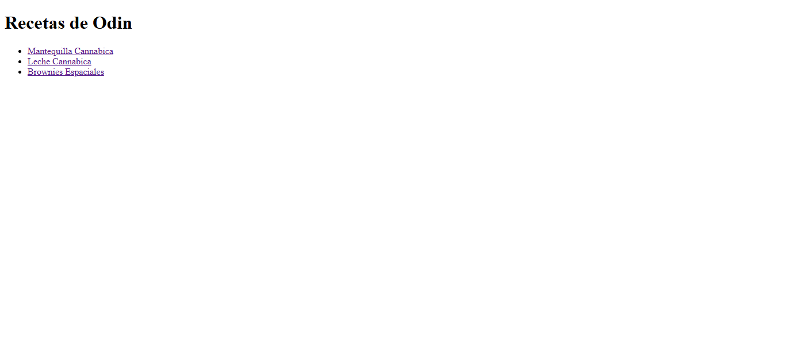

# odin-recipes

Poniendo en práctica todo el conocimiento de _HTML_ basico adquirido. En este proyecto, _se creo un sitio web básico de recetas_.

El sitio web constá de una página de _índice_ principal que tendrá _enlaces_ a algunas recetas. El sitio web no se verá muy bonito, pero es importante tener en cuenta que este proyecto es solo para desarrollar las herramientas _HTML_; volvere a revisar este proyecto en el futuro para darle estilo con _CSS_.

